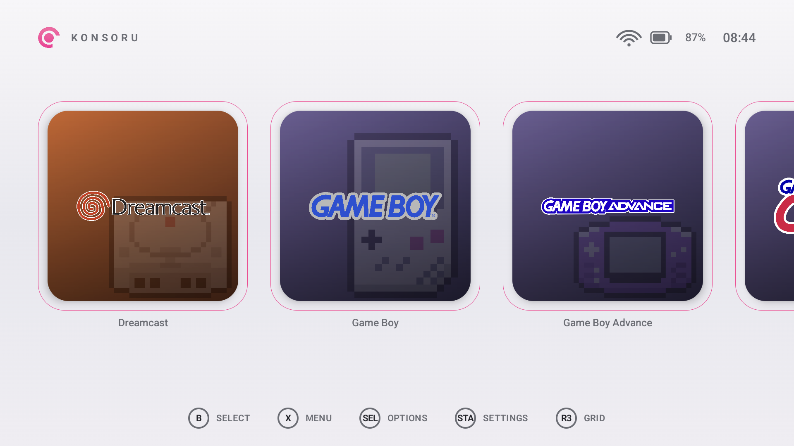
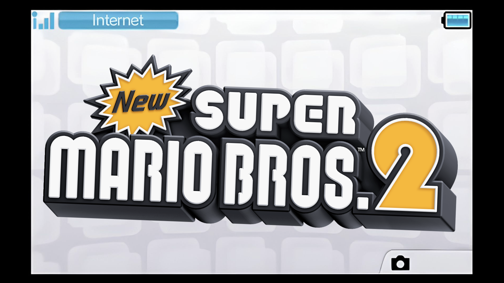
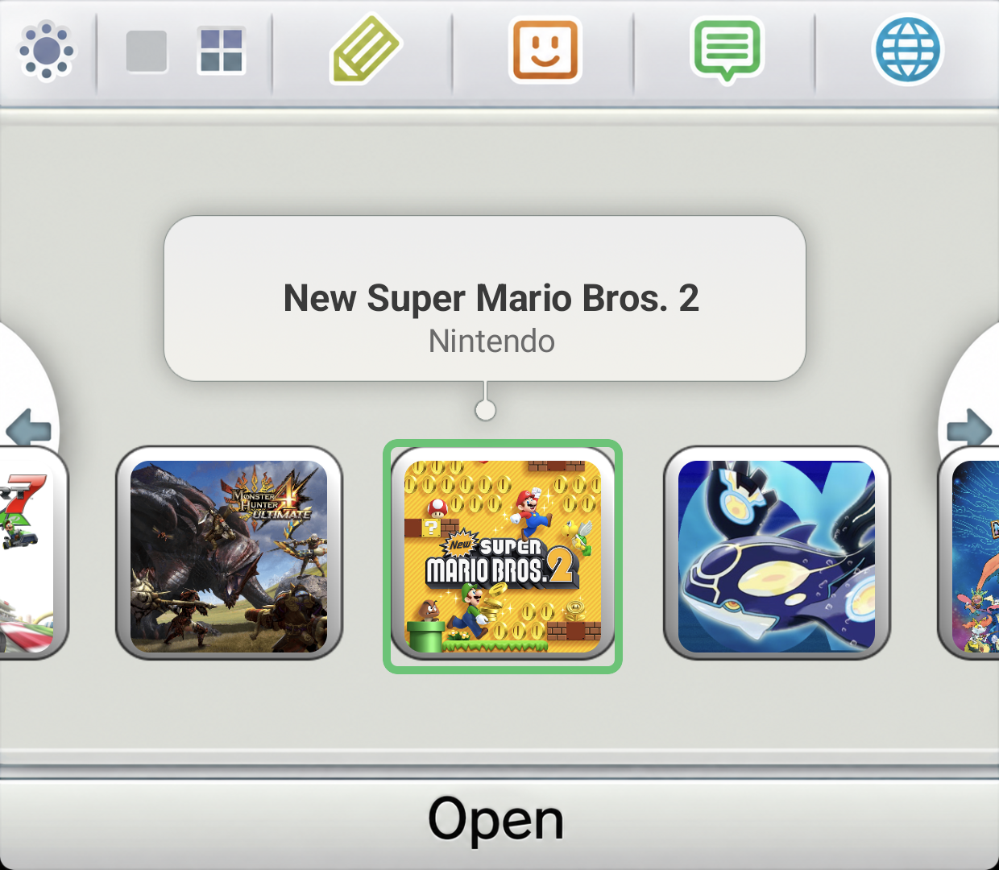
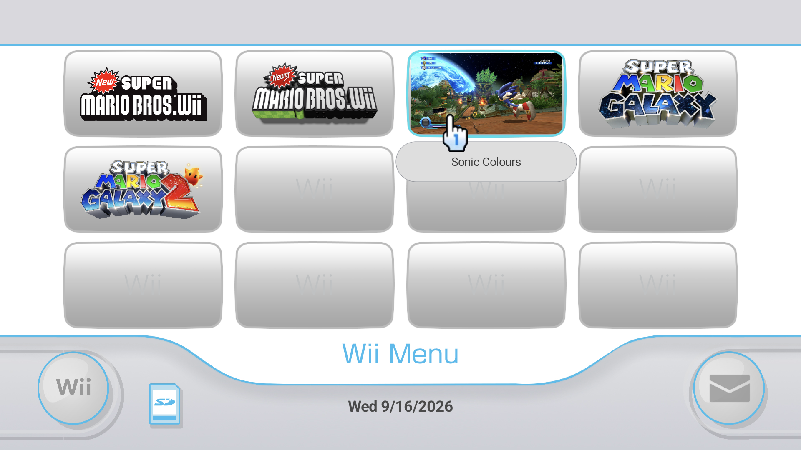
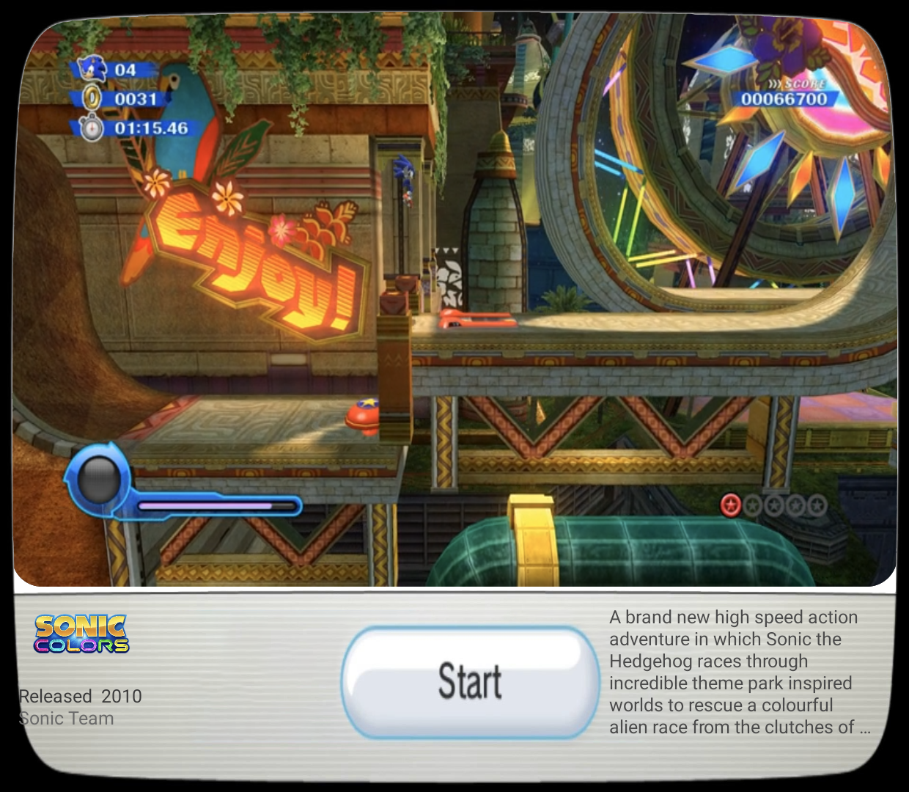
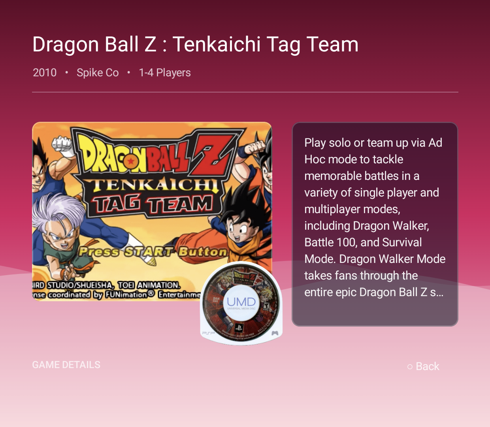

# KONSORU Launcher

**A native Android HOME-replacement for the AYN Thor, with a bespoke themed UI per emulated console.**

[Download](../../releases/latest) · [Discord](https://discord.gg/XSmG3crde9) · [Ko-fi](https://ko-fi.com/hollywoodkills) · [Feedback](../../discussions)

## ⚠️ Public beta — not a finished product

KONSORU is shared to get it in front of real AYN Thor owners and collect feedback. It is **not**
feature-complete and **will** have rough edges — see [Known issues](#known-issues). If something
looks broken, feels off, or an emulator won't boot a game for you, please say so on
[Discord](https://discord.gg/XSmG3crde9) or in a [discussion](../../discussions).

No source code is published in this repository — this is a binary-only release for testing and
feedback.

## About

KONSORU replaces your AYN Thor's homescreen entirely. Instead of one generic list for every system,
**each emulated console gets its own interface** — not a skin over a shared grid, but the console's
actual menu: the Wii's channel grid, the PSP's XMB, the 3DS HOME menu across both screens.

The Thor's second screen is part of it. While you browse a console's games up top, the lower screen
shows live details for whatever is highlighted — and for the DS and 3DS the roles flip to match the
real hardware, with the icon grid on the bottom screen and the game's logo art on top.

## Screenshots

**Home — pick a system**

**Nintendo 3DS — both screens, like the real thing**

| Top screen | Bottom screen |
|---|---|
|  |  |

**Wii — the channel grid, and a channel's own screen below**

| Top screen | Bottom screen |
|---|---|
|  |  |

**PSP — game details on the lower screen, UMD and all**

## Features

- Native Android HOME replacement — boots straight into KONSORU
- **21 consoles with their own interface**: Switch, PS3, PS2, PSX, PSP, Xbox, Xbox 360, GameCube,
  Wii, Wii U, N64, 3DS, DS, SNES, NES, GBA, GBC, GB, Genesis, Saturn, Dreamcast. Anything else
  falls back to a clean generic grid with real cover art
- Cartridge insertion animation on launch for the handheld systems
- Dual-display second-screen details view — or **Single Screen Mode** for devices without one
- **LaunchBox Games Database** as the metadata scraper, including searching it by name or pasting a
  game's own database ID for an exact match
- Customisable home: 1–4 rows, pinned Android apps and shortcuts, a five-slot dock, and the option
  to hide systems or individual games
- Per-platform emulator selection with RetroArch core support, plus per-game overrides
- Built-in on-screen keyboard (QWERTZ/QWERTY) — the system keyboard cannot be driven with a d-pad
- In-app update checker with a stable/prerelease channel toggle

## RomM support

If you run a [RomM](https://romm.app) server, KONSORU works as a full client. Point it at your
server under Settings → RomM; without an address and token none of this does anything.

- **Library sync** — your whole RomM library appears on the shelves. Games you don't have yet sit
  dimmed behind the installed ones, with the server's cover art, so the shelf is your library rather
  than just what fits on the card
- **Downloads** — one press, with progress and a queue that keeps running when you close the popup,
  and the game is scraped the moment it lands
- **Save sync, per game** — it works out which *games* have saves on this device rather than asking
  you to pick an emulator, across 34 standalone emulators plus RetroArch (whose paths are read from
  your own `retroarch.cfg`, per-core folders included). Newest wins, identical saves are left alone,
  nothing is ever merged or deleted
- **Syncs on its own** — when you put a game down, and if you were offline it uploads everything
  that piled up as soon as you're back
- **Play state** — `last played` and `now playing` report back to RomM like any other client
- **Folder mapping** — point any platform folder on your server at a system here, or mark it "don't
  sync", so it doesn't matter whether your PlayStation folder is `psx`, `ps`, or something else

## Known issues

- Public beta — expect bugs, most notably around getting specific emulators to boot a game on some
  platforms
- Built and tested specifically against the AYN Thor; behaviour on other Android devices is
  unverified
- Save detection matches saves to games by filename. Emulators that name saves after an internal
  game ID instead — Dolphin's GameCube memory cards, Cemu and PPSSPP's per-title folders — are not
  matched yet

## Installation

1. Download the latest APK from [Releases](../../releases/latest)
2. Allow installing apps from the source you downloaded it with (Android prompts you the first time)
3. Install the APK
4. On first launch, KONSORU asks you to pick your ROM folder, then walks you through the rest

To make KONSORU your default Home app, press the physical Home button and choose it when Android
asks, or set it under Android's own Home app settings.

## AI Disclosure

KONSŌRU is created and directed by Fabian Z., an independent app developer. The project uses Claude and Claude Code as development tools for debugging, code review, and documentation. AI-assisted code may be present in this repository.

All product decisions – features, design, priorities, and releases – are human-led. AI output is evaluated before inclusion.

For attribution of third-party code, assets, and libraries, see separate documentation.
## Feedback & support

This release exists to collect feedback — bug reports, impressions, platforms you'd like themed
next, anything. Please don't hold back.

- **Discord**: [discord.gg/XSmG3crde9](https://discord.gg/XSmG3crde9) — bugs, feedback, general chat
- **Support the project**: [ko-fi.com/hollywoodkills](https://ko-fi.com/hollywoodkills)
- **Bug reports / feature requests**: [GitHub Discussions](../../discussions) on this repo
